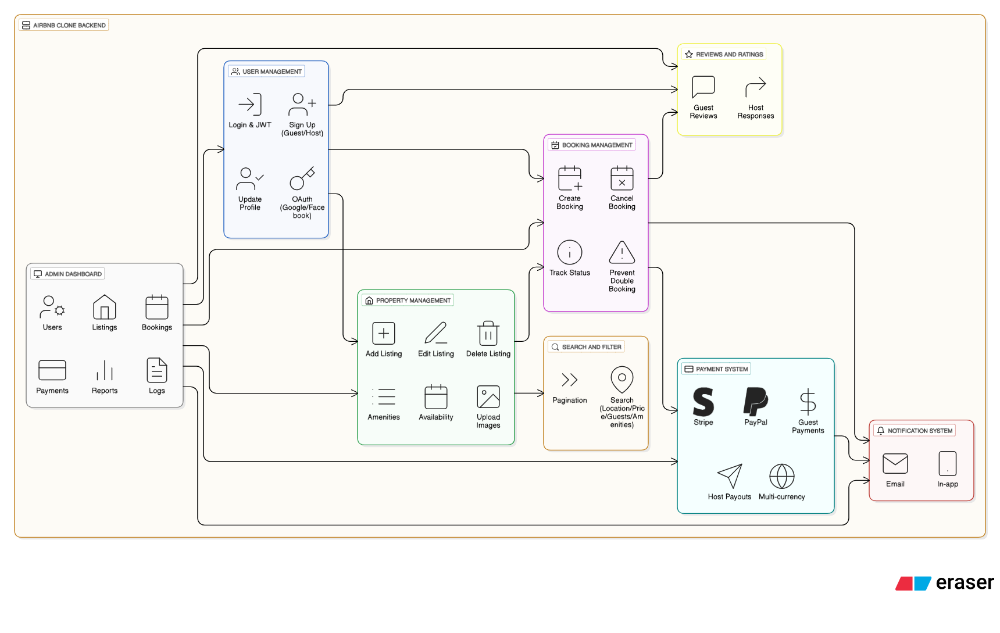

# Airbnb Clone Backend – Features & Functionalities

## Overview
This document outlines the key backend features and functionalities required to power the Airbnb Clone platform. It defines the core modules, user interactions, and system capabilities.

## Core Functionalities
1. **User Management**
   - User registration (Guest/Host)
   - Login & JWT authentication
   - OAuth (Google/Facebook)
   - Profile update and management

2. **Property Listings Management**
   - Add, edit, and delete property listings
   - Manage property images and details

3. **Search and Filtering**
   - Search by location, price, and amenities
   - Pagination for large datasets

4. **Booking Management**
   - Create and cancel bookings
   - Prevent double bookings
   - Track booking status (pending, confirmed, completed)

5. **Payment Integration**
   - Secure payments via Stripe/PayPal
   - Automatic payouts to hosts
   - Multi-currency support

6. **Reviews & Ratings**
   - Leave and view reviews linked to bookings
   - Host responses

7. **Notifications**
   - Email and in-app alerts for bookings and payments

8. **Admin Dashboard**
   - Manage users, listings, and transactions

## Technical Requirements
- RESTful API using Node.js and Express.js
- PostgreSQL database for relational data
- JWT authentication & role-based access control
- Cloud image storage (e.g., AWS S3)
- Logging & error handling
- Scalable modular architecture

## Diagram
Below is a visual overview of the backend features.

---

© 2025 ALX | Backend Blueprint: Feature Foundations

