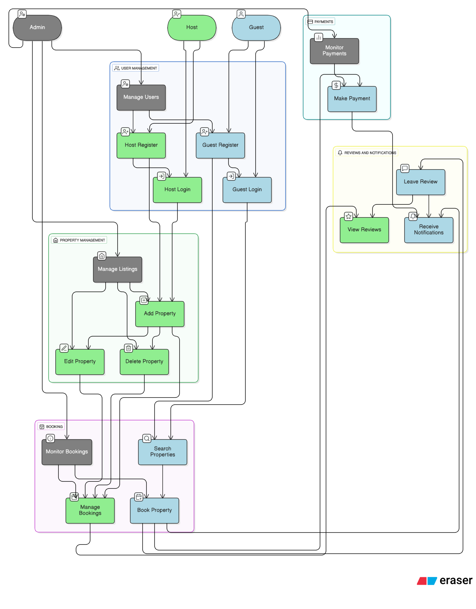

# Airbnb Clone Backend – Use Case Diagram

## Overview
This document presents the **Use Case Diagram** for the Airbnb Clone backend system.  
It visualizes how different users (actors) interact with the system’s main features and functionalities.

## Actors
- **Guest:** Can register, log in, search for properties, make bookings, process payments, leave reviews, and receive notifications.  
- **Host:** Can register, manage properties, handle bookings, view reviews, and receive notifications.  
- **Admin:** Can manage users, properties, bookings, and oversee payments and reports.

## Use Cases
1. User Authentication (Register/Login)
2. Property Management (Add/Edit/Delete)
3. Search and Filter Properties
4. Booking Management (Create/Cancel)
5. Payment Processing
6. Reviews and Ratings
7. Notifications
8. Admin Controls (Manage Users, Listings, Reports)

## Diagram
Below is the visual representation of the system’s use cases and actors:

---

© 2025 ALX | Backend Blueprint: Feature Foundations

